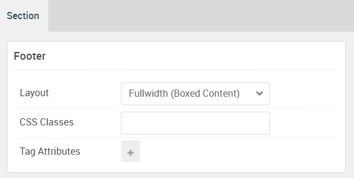

## Introduction

:	1. **Custom HTML (Particle)** [5%, 1%, se]
	2. **Newsletter (Particle)** [5%, 60%, se]

The **Footer** section includes two particles: **Custom HTML** and a **Newsletter** particle assigned to the **footer-a** and **footer-b** module positions.

Here is a breakdown of the module(s) and particle(s) that appear in this section:

* [Custom HTML (particle)](#custom-html-(particle))
* [Newsletter (particle)](#newsletter-(particle))

## Section Settings

| Option           | Setting                   |
| :--------------- | :----------               |
| Layout           | Fullwidth (Boxed Content) |
| CSS Classes      | Blank                     |
| Tag Attributes   | Blank                     |

## Custom HTML (Particle)

The **Simple Content** particle is a **Gantry 5 Particle** module placed within the **footer-a** module position. You can create a module position by dragging and dropping a **Module Position** particle into the desired location within the **Layout Manager**. The module position's settings are as follows.

### Module Position Particle Settings

#### Particle Settings

| Option        | Setting          |
| :-----        | :-----           |
| Particle Name | `FP Extension A` |
| Key           | `footer-a`    |
| Chrome        | `gantry`         |

#### Block Settings

| Option         | Setting   |
| :-----         | :-----    |
| CSS ID         | Blank     |
| CSS Classes    | Blank     |
| Variations     | Blank     |
| Tag Attributes | Blank     |
| Fixed Size     | Unchecked |
| Block Size     | `60%`     |

### Custom HTML Particle Settings

The next step involves assigning the particle to the module position. Adding a particle to a module position can be done by creating a **Gantry 5 Particle** module by navigating to **Admin > Extensions > Modules** and clicking the green **New** button. Select the **Gantry 5 Particle** module type and create the particle using the settings found in the section below, and assigning it to the position.

#### Particle Settings

| Option             | Setting       |
| :-----             | :-----        |
| Particle Name      | `Custom HTML` |
| Process Twig       | Unchecked     |
| Process Shortcodes | Unchecked     |

**Custom HTML**

~~~ .html

<ul class="nomarginall noliststyle">
<li><a href="#">About</a></li>
<li><a href="#">Our Blog</a></li>
<li><a href="#">Our Team</li>
<li><a href="#">We're hiring!</a></li>
</ul>

<ul class="nomarginall noliststyle">
<li><a href="#">FAQ</a></li>
<li><a href="#">Support</a></li>
<li><a href="#">Showcase</li>
<li><a href="#">Contact Us</a></li>
</ul>

<ul class="nomarginall noliststyle">
<li><a href="#">Tumblr</a></li>
<li><a href="#">Facebook</a></li>
<li><a href="#">Twitter</li>
<li><a href="#">Pinterest</a></li>
</ul>

~~~

## Newsletter (Particle)

The **Newsletter** particle is a **Gantry 5 Particle** module placed within the **footer-a** module position. You can create a module position by dragging and dropping a **Module Position** particle into the desired location within the **Layout Manager**. The module position's settings are as follows.

### Module Position Particle Settings

#### Particle Settings

| Option        | Setting          |
| :-----        | :-----           |
| Particle Name | `FP Extension A` |
| Key           | `footer-a`    |
| Chrome        | `gantry`         |

#### Block Settings

| Option         | Setting   |
| :-----         | :-----    |
| CSS ID         | Blank     |
| CSS Classes    | Blank     |
| Variations     | Blank     |
| Tag Attributes | Blank     |
| Fixed Size     | Unchecked |
| Block Size     | `40%`     |

### Newsletter Particle Settings

The next step involves assigning the particle to the module position. Adding a particle to a module position can be done by creating a **Gantry 5 Particle** module by navigating to **Admin > Extensions > Modules** and clicking the green **New** button. Select the **Gantry 5 Particle** module type and create the particle using the settings found in the section below, and assigning it to the position.

#### Particle Settings

| Option         | Setting                                                                       |
| :-----         | :-----                                                                        |
| Particle Name  | `Newsletter`                                                                  |
| CSS Classes    | Blank                                                                         |
| Width          | Full Width                                                                    |
| Layout         | Stack Compact                                                                 |
| Style          | Square                                                                        |
| Title          | Blank                                                                         |
| Heading Text   | `Let's stay in touch. Subscribe to our newsletter to get the weekly updates.` |
| Side Text      | Blank                                                                         |
| InputBox Text  | `Your email address`                                                          |
| Button Icon    | `fa fa-chevron-circle-right`                                                  |
| Button Text    | Blank                                                                         |
| Feedburner URI | Blank                                                                         |
| Button Classes | Blank                                                                         |