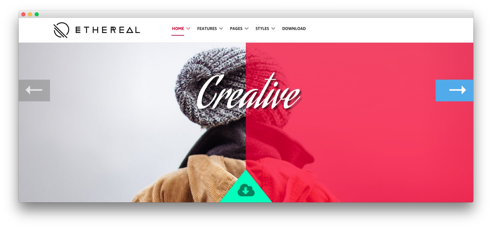

Introduction
-----

Ethereal is an exquisitely designed theme, bursting with elegance, sharpness and bold, but complementary visuals; achieved via a subtle color scheme with dashes of vibrancy, within a rich framework of emphasized typography and iconography.

Requirements
-----
* Apache 2.2+ or Microsoft IIS 7
* PHP 5.4+ (PHP 5.5+ Recommended)
* MySQL 5.1+
* WordPress 4.2.1+

>> NOTE: Gantry v5.1.3+ is required for Ethereal to work correctly. For more details on the Gantry Framework, please visit its [Dedicated Website](http://gantry.org). On WordPress, [Timber](https://wordpress.org/plugins/timber-library/) is also required for the Gantry Framework's Twig to be read by WordPress.

Key Features
-----

* Responsive Layout
* 10 Preset Styles
* Block Variations
* Custom Typography
* Unlimited Positions
* Custom Particles
* Dropdown Menu
* RokSprocket Styling
* Social Icons
* Mobile Menu
* Coming Soon Page
* Offline Page
* Font Awesome Icons
* YAML-based Configuration
* Twig Templating
* Powerful Particle System
* Visual Menu Editor
* MegaMenu Support
* Off-Canvas Panel
* Ajax Admin
* Layout Manager
* Theme Inheritance
* SCSS Support
* Sophisticated Fields
* Unlimited Undo/Redo

## Layout Manager

The Gantry 5 Layout manager benefits from a drag and drop interface, providing an easy mechanism for configuring positions and particles. Furthermore, there are now no restrictions to the number of positions you can have. It is truly unlimited.

## Style Settings

Callisto's pre-built presets are displayed in the Styles tab for you to preview, individually customize and apply. You'll also find an assortment of individual style options, such as text and background colors for the various sections, allowing for easy color changes.

## Responsive

A responsive layout adapts to the viewing device's width, such as mobile, tablet or desktop. Mobile modes have a unique menu to aid usability. Support classes can also be used to display or hide various types of content for each device.
