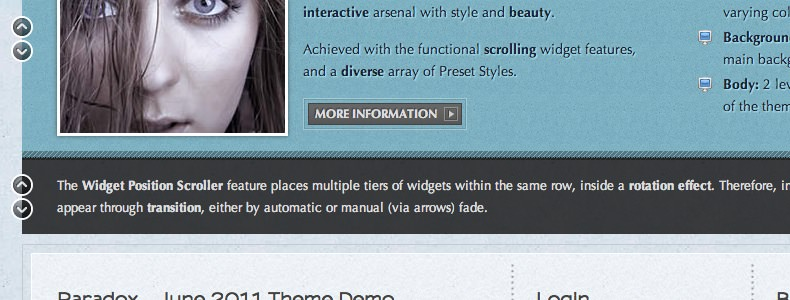
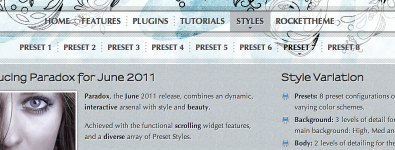

Introduction
------------

Paradox combines a dynamic, interactive arsenal with style and beauty; achieved with a diverse array of presets. The theme's styles have varying background and bodylevels: High, Medium or Low, combined with the 8 presets, which allow for a varied appearance.

Requirements
------------

* Gantry 4 Framework
* FF, Safari, Chrome, Opera, IE8+
* PHP 5.2.17+ (5.3+ recommended)
* WordPress 3.2+, 4.0+

> > NOTE: An updated version of RokCommon is required for Paradox to work properly. For more details on the Gantry Framework, please visit its [Dedicated Website](http://www.gantry.org/).

Key Features
------------

* 960 Fixed Layout
* 8 Preset Styles
* 70 Widget Positions
* 25 Widget Variations
* Fusion-Menu and Split-Menu
* Custom Typography
* iPhone Theme
* iPhone Menu
* Background Level Configuration

### Background Rotator

Scrolling Positions is a feature of Gantry, which, when activated, modifies the behaviour of stacked widgets. Instead of appearing vertically, the additional widgets become accessible via a button for the Top, Showcase, Feature or Bottom Widget rows.

### Fusion Menu

There are two menu options, SplitMenu and Fusion Menu. The Splitmenu is a static menu system that displays select menu items in a main horizontal menu. The Fusion Menu is an advanced, CSS based menu system, which offers a wide range of per menu options.
