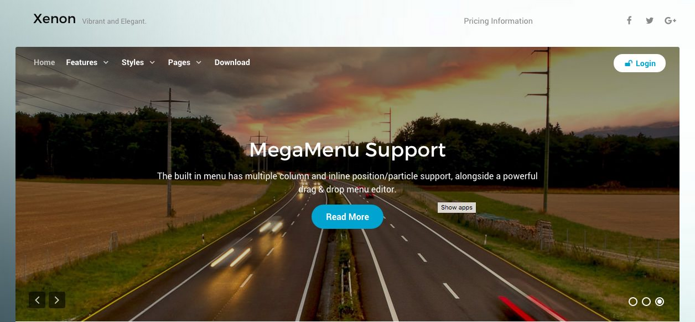

Introduction
-----

Xenon is an excellent example of precision design, with refined elements and structures to combine vibrancy, elegance and flexibility within one entity. The theme is saturated with rich typographical elements to enhance your content.

Requirements
-----
* Apache 2.2+ or Microsoft IIS 7
* PHP 5.4+ (PHP 5.4+ Recommended)
* MySQL 5.1+
* WordPress 4.3+

>> NOTE: Gantry v5.2.4+ is required for Xenon to work correctly. For more details on the Gantry Framework, please visit its [Dedicated Website](http://gantry.org). On WordPress, [Timber](https://wordpress.org/plugins/timber-library/) is also required for the Gantry Framework's Twig to be read by WordPress.

Key Features
-----

* Responsive Layout
* 6 Preset Styles
* Block Variations
* Custom Typography
* Unlimited Positions
* Popup Widget
* Custom Particles
* Horizontal Menu
* Social Icons
* Mobile Menu
* Coming Soon Page
* Font Awesome Icons
* YAML-based Configuration
* Twig Templating
* Powerful Particle System
* Visual Menu Editor
* MegaMenu Support
* Off-Canvas Panel
* Ajax Admin
* Layout Manager
* Theme Inheritance
* Fluid Width Option
* Fixed Width Option
* SCSS Support
* Sophisticated Fields
* Unlimited Undo/Redo

## FixedSide

The FixedSide position is similar to offcanvas, by allowing you to position blocks outside of the main wrapper of the theme. For Xenon, FixedSide contains the logo, social icons and menu, but can be adjusted to use whatever blocks you prefer.

## Particles

Xenon includes a selection of custom Particles available for demonstration in our Typography page. Particles operate as customizable blocks that form the flesh of the frontend, from placeholders to self contained content and functions.

## Responsive

Xenon is a responsive theme which means it adapts to the viewing device's width, such as mobile, tablet or desktop. Mobile modes have a unique menu to aid usability. Support classes can also be used to display or hide various types of content for each device.
